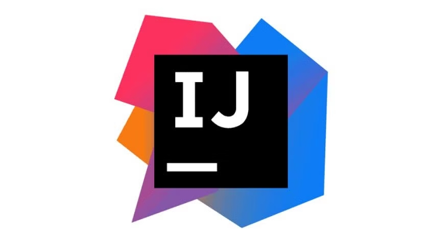

# From Browser to Desktop!

From learning about IDE’s (integrated development environment) and GitHubs Desktop, I got to implement new tools under my belt of coding and software development. It was a really exciting learning process to understand that not only we can code from our local computer but, any computer! Parting ways from JSfiddle, was a really big change for me to get used to, but in this case it was a positive change for me to understand the most beneficial way to work. Due to the fact that it provided an easier way to organize my projects and repositories, and code with the help of ESlint, a tool that will help assist the user with coding.

When creating or starting a new project, it was really hard to understand at first but as I passed the learning curve for its knowledge, it is really easy and organized to create new repositories. I loved that we could create new repositories in our local desktop and not depend on the browser or internet to do so. Having to do things locally gave me the sense of working in environments that are flexible, and this is something I believe that computer science majors should know how to do. IntelliJ, the IDE that I've learned to use, is a code editing software that provides us the place to create and edit code. It goes hand in hand with GitHub’s Desktop, I have GitHub Desktop create a repository and I edit that repository on IntelliJ. While IntelliJ is one of the many IDE’s out there, this IDE provides the user with a friendly interface that will be easily guidable to their [website](https://www.jetbrains.com/help/idea/getting-started.html). This is what I believe to be a positive learning process when switching from browser to desktop.

Now that I mentioned Intellij, one of the amazing features that was added into the IDE that we plugged in was ESlint. This tool was a life saver, it sped up the process for me to debug certain coding problems that I have overlooked. It would go through the entire code and find what is optimal or what should be changed for the code to not have a problem when running it. There are shortcuts to scout around the codes such as “f2”, to speed up the process of finding the error when using ESlint. Learning how to implement this into IntelliJ was a very knowledgeable experience due to the fact that there are many more tools out there that people create to help users like me to code without the feeling of regret when we stumble upon a problem when the solution was to put a “;”. This is the last reason I believe to be positive as I learned about using my desktop to code instead of a browser.

Furthermore the learning experience for me during the transition from browser to desktop was a knowledgeable and positive experience. Due to the experience I received from using GitHub Desktop and IntelliJ to organize my projects properly, and having a wonderful tool such as ESlint to provide assistance when I become clueless. There are many more things that is yet to be found to be a great coder and I feel as If this is big leap towards that goal.
