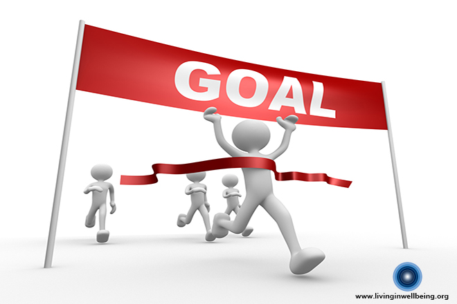
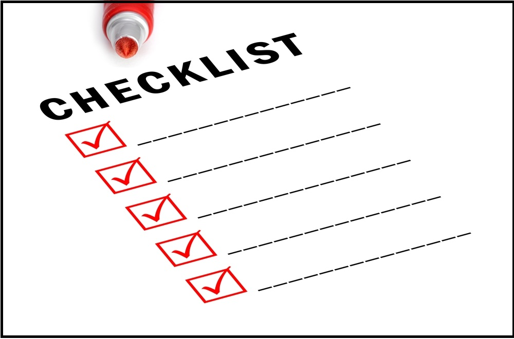

# Smart Goals!

## Looking at my "smart goals" that I have created.

1) I want to accomplish learning about softwares and how software engineering differs from programming. I will know that I reached this goal when I have created a software or worked with them till it is completed. This is attainable through this class. Its relevant due to the fact that I want to pursue a degree in computer science. Achieved hopefully after this class.

2) I would like to be able to work comfortably with different tools that I have never used to create softwares, programs, and code. I would probably reach this when I have the ability to create and fully understand the background of softwares through the projects that we will have in this course. This is attainable as well through the development of projects that will be completed. Relevance through my goal of trying to understand the ground up of things related to coding. Achieved hopefully after this class as well.

3) I would like to be able to bond and share connections in this class either through the teacher, or students. Having connections and being able to have the skill to work with a team or partner is a must have for me. I will know so through the great value that I have recieved when working with people next to me. Every little group excercise is a practice towards this goal. Its attainable because its a skill that just needs to be sharpened. Relevent to the fact that the world is not lonely. Its something that is Achieved at any time but must be used or the skill will rust.

## Looking Back At It

When reflecting on what I wanted to accomplish during this semester, my aim was to develop a good understanding of the software and tools that we were going to learn, and to establish strong connections with the people around me. As we are now in the 7th week of the semester, I can confidently say that I am on the right track to achieving my goals as a scholar and a learner in this field of science. I have engaged in hands-on exercises that have enhanced my understanding of software engineering, and I have enjoyed networking with my peers. Through collaboration, I have not only gained valuable experience but also formed new friendships with individuals who share interests in computer science and other hobbies. Reflecting on my progress, I am pleased with how far I have come in relation to my initial goals.

AI was used to fix any grammatical errors on this reflection.