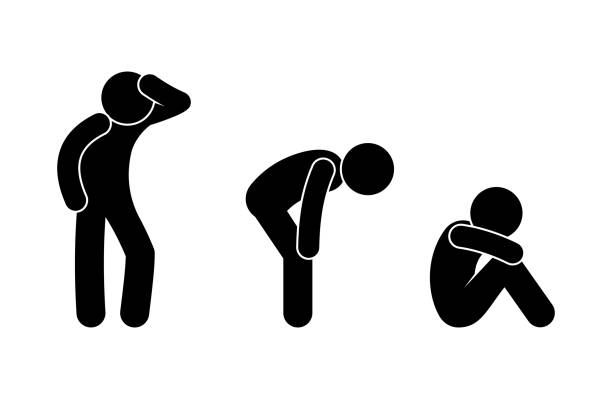

# Is The Struggle Worth It?

Everything we see online is created either through the use of HTML. In relation to that, learning about this type of "coding" is an essential way to progress in the fields of software engineering and computer science. This is because learning HTML, CSS, and Bootstrap provides the basic understanding needed to see from the perspective of a computer scientist, and Bootstrap offers an easy experience through the learning curve.

Websites like [Facebook](https://www.facebook.com/), [Twitter](https://twitter.com/?lang=en), and [YouTube](https://www.youtube.com/) are part of our daily media consumption, providing mass media influence and knowledge that connects people worldwide. However, what often goes overlooked is that these sites and webpages are created using programming languages such as HTML and CSS. Constant updates aimed at enhancing user experience invariably involve editing the website's code. Recognizing that a website is essentially code is a perspective akin to that of a computer scientist, offering insights into the possibilities for creating similar sites. Therefore, understanding these programming languages becomes an important learning curve.

Building on the importance of these programming languages that help create a website idea from a blank canvas, there are inherent difficulties that any new beginner to a new hobby will encounter. It is hard! But just as learning takes time, there are elements that support the goal of mastering the knowledge of HTML and CSS, among which is Bootstrap. Bootstrap is a library filled with classes, styles, IDs, and much more. It provides fluidity to what can otherwise be quite complicated. This means that the learning experience is crucial, so much so that tools like Bootstrap are created to facilitate a quicker learning experience.

Furthermore, programming languages such as HTML, CSS, and the use of Bootstrap to implement an easier learning experience are such important stepping stones for programmers, such as myself, to fully comprehend. There will always be changes in upcoming programming styles, and it is best to understand a multitude of language styles instead of being a master at one.

