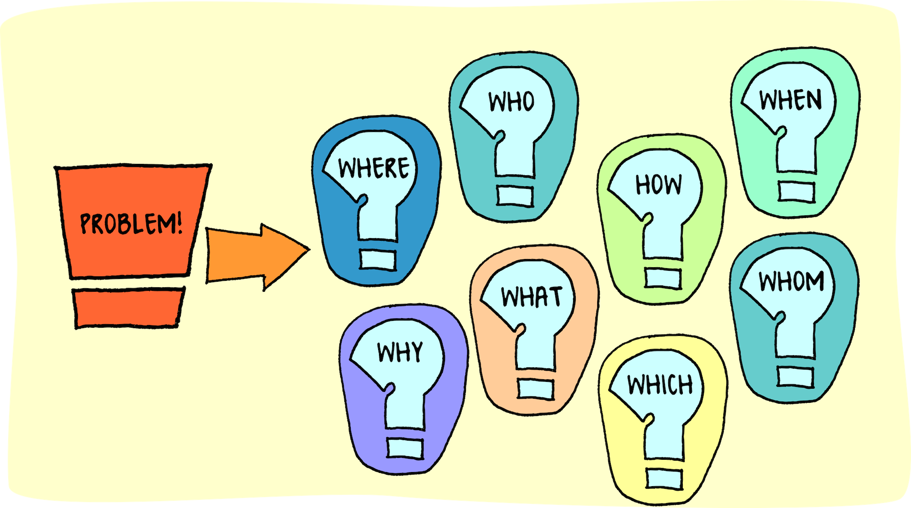

## Antidote?

In the realm of computer science, the journey from novice to adept programmer is marked by numerous milestones, one of the most significant being the understanding and application of design patterns. Design patterns are reusable solutions to common problems encountered in software design and development. They provide a structured approach to solving issues, serving as blueprints that streamline the coding process and enhance the quality of software products.

### Problem Solving

As I ventured deeper into the world of programming and collaborated with my team on various projects, I refined my problem-solving skills. When faced with challenging coding tasks, I didn't let frustration take over. Instead, I approached the problems systematically, breaking them down into manageable parts. I relied on resources like Stack Overflow to guide me through intricate issues. One memorable instance of this approach was when I encountered a particularly tough coding challenge. By carefully crafting implementations and testing each step along the way, I ensured accuracy and efficiency in my solutions. This methodical approach not only helped me overcome specific challenges but also instilled in me a disciplined problem-solving mindset crucial for navigating the complexities of software development.

### Great Team Experience!

When I worked closely with my team on a software project, I quickly realized the importance of teamwork and collaboration. Being part of a cohesive team was essential for achieving our shared goals effectively. As I delved deeper into developing design patterns, I found that my growth as a team player went hand in hand with my progress as a programmer. Interacting with my peers and observing their approaches to design patterns proved to be incredibly valuable. It gave me fresh perspectives and insights that helped me evolve my own coding practices. Through studying different design methodologies and analyzing their strengths, I was able to refine my skills and discover innovative techniques. This collaborative exchange wasn't just about individual growth; it fostered a culture of continuous learning and improvement within our team. We shared our experiences and strategies for tackling design challenges, which not only expanded our repertoire of design patterns but also strengthened our bonds as a team. These shared experiences laid a solid foundation for future collaborative endeavors, reinforcing the importance of teamwork in our journey of software development.

### So, What was learned?

In wrapping up, embracing and perfecting design patterns have been pivotal in my personal and professional development within computer science. By employing effective problem-solving techniques and fostering teamwork, I've not only sharpened my programming abilities but also played a part in advancing our collective efforts in software development. Moving forward, I'm dedicated to utilizing design patterns as guiding principles in my pursuit of innovation and excellence in the field of software engineering.