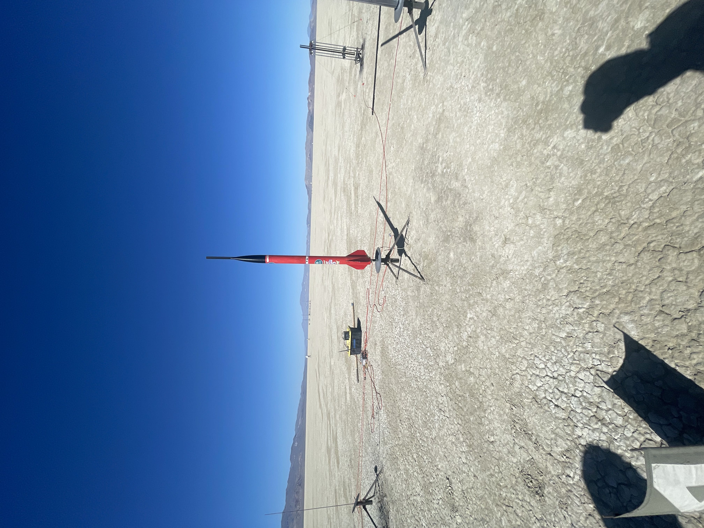
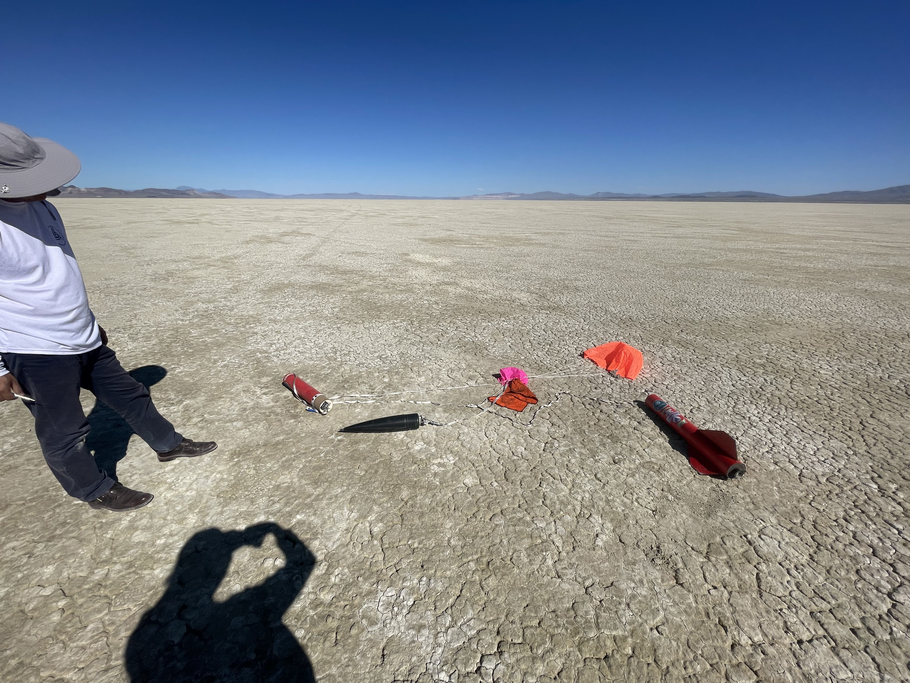

  
  

# Overview of Project
The project centers around the development of our rocket, with a focus on the avionics bay, which aligns with my area of expertise. Specifically, I've programmed two altimeters: the RRC3 by MissleWorks and the Telemega by AltusMetrum. Both are configured to trigger an event once the rocket reaches apogee, the highest point of its altitude during launch. These events include deploying a drogue parachute approximately 2 seconds after reaching apogee, which serves to stabilize the descent and prevent excessive drift. Subsequently, the final event involves deploying the main parachute when the rocket descends to an altitude of approximately 700-800 feet, ensuring a safe landing.

# My experience
My experience with this project has been immensely beneficial for my development as both a student and a computer science major. Despite its minimal connection to my technical coding field, it has afforded me the opportunity to enhance my skills in team management, planning, and communication. Presenting our project serves as a foundational step toward participating in the First Nations Launch event scheduled for the spring of 2024.
Here is the offical link to [First Nations Launch](https://spacegrant.carthage.edu/first-nations-launch/)
