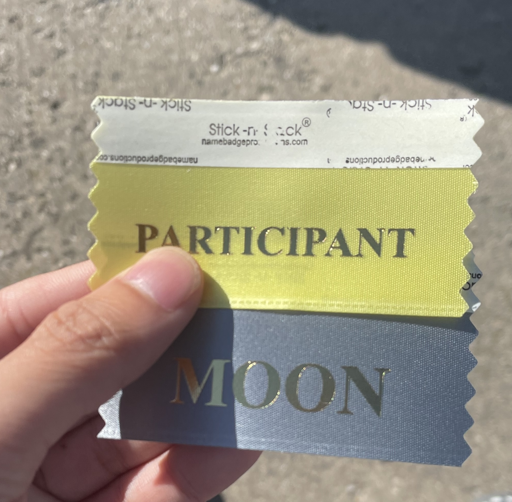
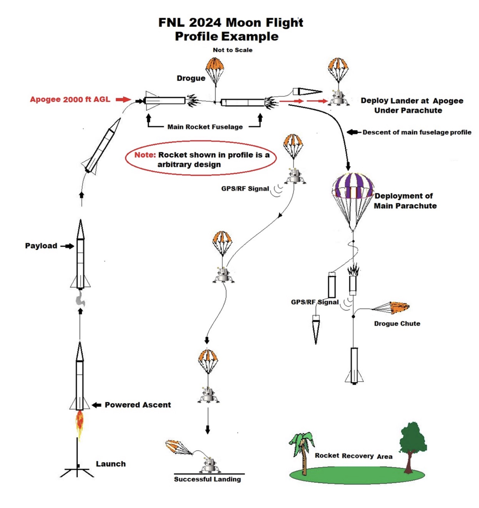
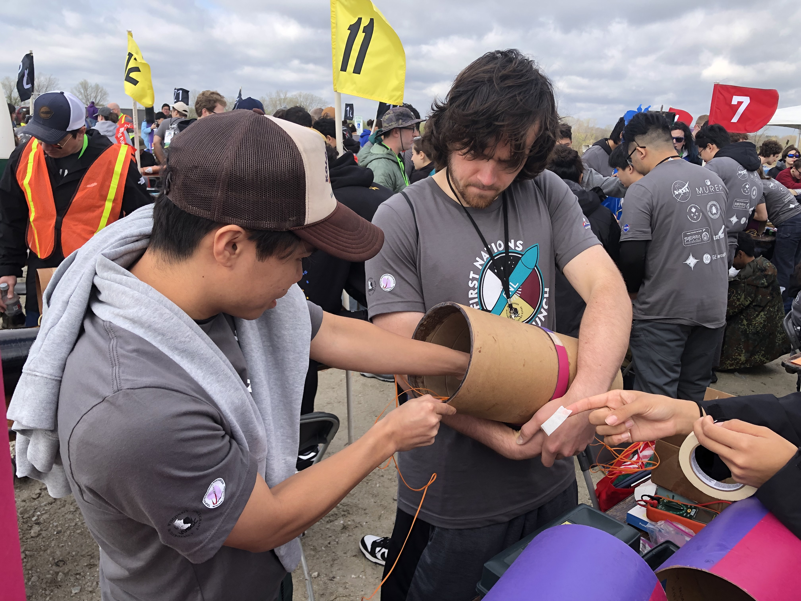
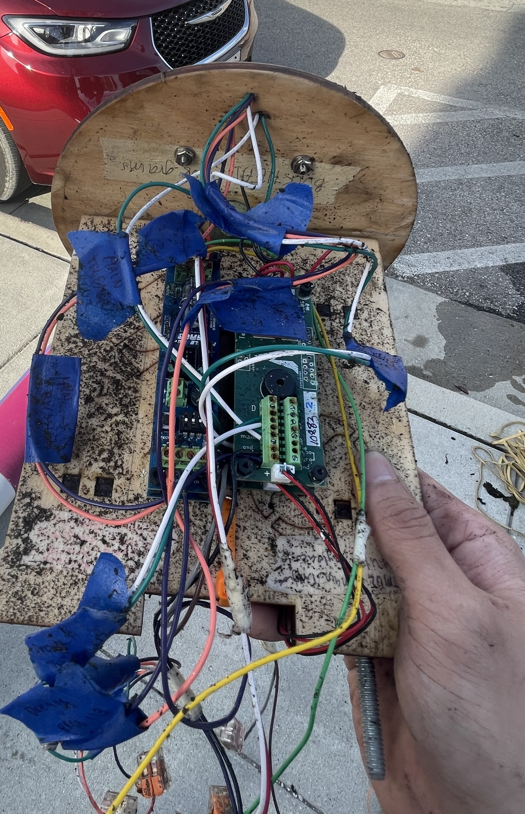

# Overview of Challenge
  As a team collectively have our desired rocket perform the task of containing a duel-deployment system, and a payload (lander), to 
  reach an altitude of 2500 ft in the air. In the descent of the rocket after apogee, an event of ejecting our payload with its own parachute,
  as well as having the rocket eject its drogue parachute. As the payload lands safely, the rocket near desired altitude when descending 
  will eject its main parachute to provide a safe landing. Having the payload and lander in relaunchable
  condition is what's considered a successful launch.

# My experience
In this group project, I was assigned a role as the team leader. Being tasked with a complete understanding of how to manage the time of my team members as well as myself. Looking for ways to solve the problem of the given challenge, I was coming across various blockades that would inhibit my ability to approach such tasks, for example, being an above-average full-time student. Although the idea of creating a desired rocket with a desired payload that completes the challenge has undergone its initial preliminary design, as well as the plan to reach our final design. I am happy with the progress we have made so far and are still continuing to exceed expectations in myself as well as my team.
Here is the offical link to [First Nations Launch](https://spacegrant.carthage.edu/first-nations-launch/)

# Results
As a result of our project efforts, our team received recognition for the best oral presentation and ranked first in safety measures. We achieved this by developing a comprehensive safety checklist, ensuring that all necessary precautions were taken and verified by team members to mitigate potential risks. Despite facing unfavorable weather conditions that prevented us from deploying our payload (Lander) as instructed by the competition judges, we successfully executed the ejection charges for both the drogue and main parachutes at the designated times.

