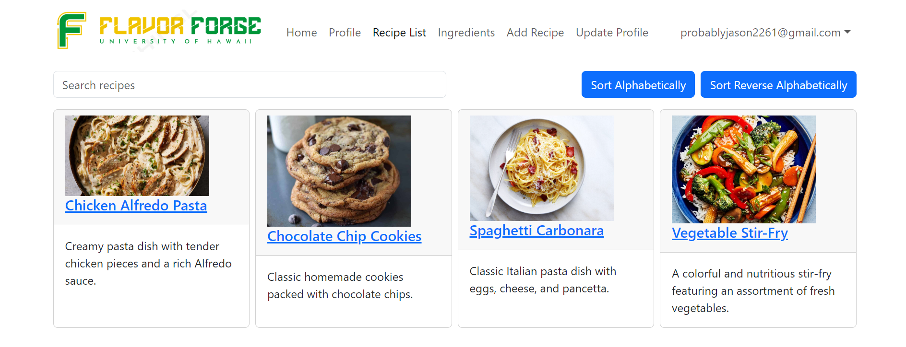
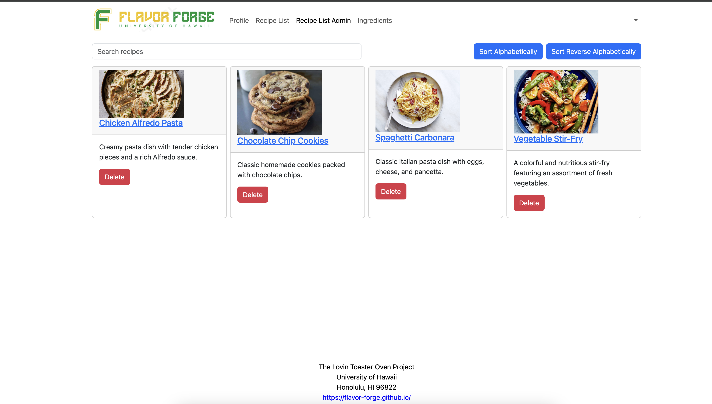
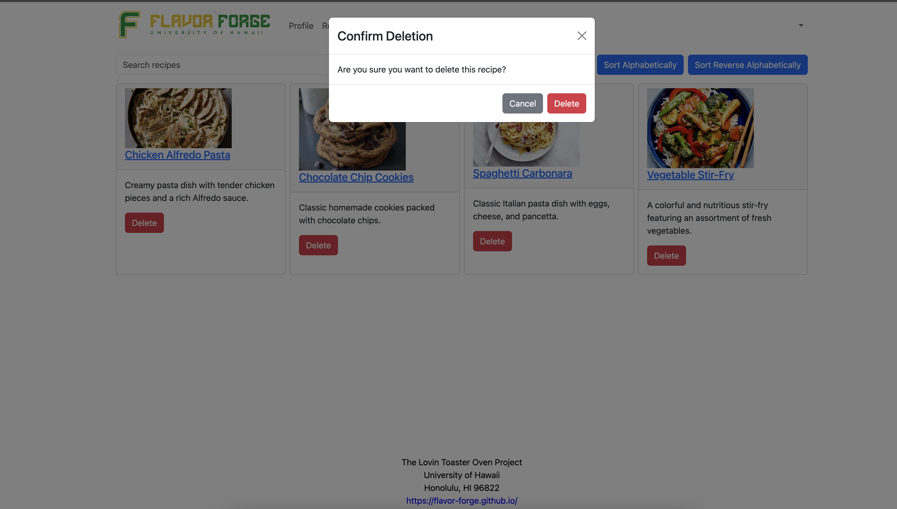

# Overview of Project
FlavorForge is designed to revolutionize the way college students approach cooking. Our platform provides a space where students can easily discover and share recipes that are perfectly suited to their limited resources and dietary preferences. Our goal is to empower students to cook nutritious and tasty meals using minimal kitchen facilities and readily available ingredients near their campus.

#### Recipe List Page

#### Recipe List Page Admin

#### Recipe List Page Admin Delete Function

# My experience
Throughout this project, we learned valuable teamwork and time management skills, establishing a routine schedule to effectively plan and meet project milestones for the successful deployment of "Flavor Forge" by Milestone 3. Despite encountering numerous challenges, including navigating our differing work styles as a newly formed team, we successfully overcame them. My assigned tasks included creating the ListRecipe Page and the Admin List recipe page, enabling users to easily browse recipes and facilitating efficient organization. Additionally, I implemented functionality for the Admin to delete recipes as needed. From milestone 1 to 3, I diligently completed these tasks, ensuring the application functioned as intended.
